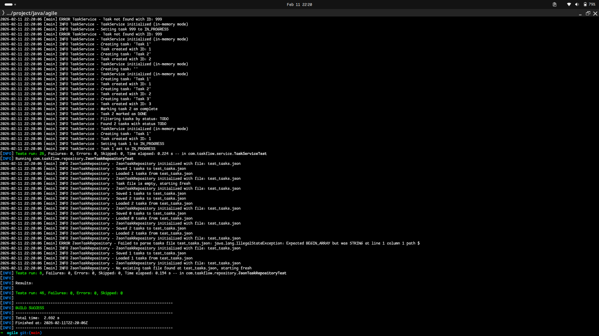

# TaskFlow - Minimal Task Management System

A lightweight, command-line task management application built with Java and Maven. TaskFlow empowers individuals to efficiently create, organize, track, and manage their daily tasks directly from the terminal.



<!--toc:start-->

- [TaskFlow - Minimal Task Management System](#taskflow-minimal-task-management-system)
  - [Product Vision](#product-vision)
  - [Features](#features)
  - [Prerequisites](#prerequisites)
  - [Installation](#installation)
  - [Quick Start](#quick-start)
  - [Usage Guide](#usage-guide)
  - [Commands](#commands)
  - [Project Structure](#project-structure)
  - [Documentation](#documentation)
  - [Development](#development)
  <!--toc:end-->

## Product Vision

TaskFlow allows individuals to efficiently create, organize, track, and manage their daily tasks from the terminal. See the [full Product Vision](./docs/PRODUCT_VISION.md) for more details.

## Features

- **Task Creation**: Create tasks with title and optional description
- **Task Organization**: Organize and view all tasks in a formatted table
- **Status Tracking**: Track task progress with three statuses (TODO, IN_PROGRESS, DONE)
- **Task Management**: Mark tasks as complete, delete, or update status
- **Filtering**: Filter tasks by status to focus on specific work
- **Persistent Storage**: All tasks are saved to JSON for data persistence across sessions
- **Command-Line Interface**: Simple, intuitive CLI for terminal-based interaction

## Prerequisites

- **Java**: Version 21 or higher
- **Maven**: Version 3.9 or higher

## Installation

### 1. Clone or Download the Repository

```bash
git clone <repository-url>
cd taskflow
```

### 2. Build the Project

```bash
mvn clean package
```

This will compile the source code, run tests, and create an executable JAR file in the `target/` directory.

## Quick Start

### Run the Application

```bash
mvn exec:java
OR
java -jar target/taskflow-1.0-SNAPSHOT.jar
```

The application will start with an interactive command-line interface.

### Run Tests

```bash
mvn test
```

This executes all unit and integration tests to verify functionality.

## Usage Guide

### Starting the Application

```bash
java -jar target/taskflow-1.0-SNAPSHOT.jar
```

You will see the TaskFlow welcome message and a command prompt where you can enter commands.

### Example Workflow

```bash
# Add a new task
> add Complete project documentation
Task added successfully (ID: 1)

# List all tasks
> list
ID | Title                          | Status      | Description
---|--------------------------------|-------------|------------------
1  | Complete project documentation | TODO        |

# Set task to in progress
> progress 1
Task updated successfully!

# View tasks again
> list
ID | Title                          | Status      | Description
---|--------------------------------|-------------|------------------
1  | Complete project documentation | IN_PROGRESS |

# Mark task as complete
> complete 1
Task marked as complete!

# Exit application
> exit
```

## Commands

The following commands are available in TaskFlow:

| Command      | Syntax                      | Description                                                  |
| ------------ | --------------------------- | ------------------------------------------------------------ |
| **add**      | `add <title> [description]` | Create a new task with optional description                  |
| **list**     | `list`                      | Display all tasks in a formatted table                       |
| **complete** | `complete <id>`             | Mark a task as complete (DONE status)                        |
| **progress** | `progress <id>`             | Set a task to IN_PROGRESS status                             |
| **filter**   | `filter <status>`           | Filter and display tasks by status (TODO, IN_PROGRESS, DONE) |
| **delete**   | `delete <id>`               | Remove a task permanently                                    |
| **help**     | `help`                      | Display the help message with available commands             |
| **exit**     | `exit`                      | Exit the application                                         |

### Task Statuses

- **TODO**: Default status for newly created tasks
- **IN_PROGRESS**: Task is currently being worked on
- **DONE**: Task has been completed

## Project Structure

```
taskflow/
├── src/
│   ├── main/java/com/taskflow/
│   │   ├── model/              # Domain models (Task, TaskStatus)
│   │   ├── service/            # Business logic (TaskService)
│   │   ├── repository/         # Data persistence (JsonTaskRepository)
│   │   ├── cli/                # Command-line interface
│   │   └── TaskFlowApplication.java  # Main entry point
│   └── test/java/com/taskflow/
│       ├── model/              # Model unit tests
│       ├── service/            # Service unit tests
│       └── repository/         # Repository integration tests
├── pom.xml                      # Maven configuration
├── README.md                    # This file
└── docs/                        # Project documentation
```

## Documentation

Comprehensive project documentation is available in the `docs/` directory:

### Project Planning & Vision

- [**Product Vision**](./docs/PRODUCT_VISION.md) - The overall vision and goals for TaskFlow
- [**Product Backlog**](./docs/PRODUCT_BACKLOG.md) - Complete list of user stories and requirements
- [**Definition of Done**](./docs/DEFINITION_OF_DONE.md) - Quality standards and completion criteria

### Sprint Documentation

- [**Sprint Plans**](./docs/SPRINT_PLANS.md) - Detailed planning for each sprint
- [**Sprint 1 Review**](./docs/SPRINT1_REVIEW.md) - Sprint 1 outcomes and completed work
- [**Sprint 1 Retrospective**](./docs/SPRINT1_RETROSPECTIVE.md) - Sprint 1 lessons learned and improvements
- [**Sprint 2 Review**](./docs/SPRINT2_REVIEW.md) - Sprint 2 outcomes and completed work
- [**Sprint 2 Retrospective**](./docs/SPRINT2_RETROSPECTIVE.md) - Sprint 2 lessons learned and improvements

## Development

### Architecture Overview

TaskFlow follows a layered architecture:

- **Model Layer**: Domain objects (`Task`, `TaskStatus`)
- **Service Layer**: Business logic and task operations (`TaskService`)
- **Repository Layer**: Data persistence (`JsonTaskRepository`)
- **CLI Layer**: User interface and command handling

### Technology Stack

- **Language**: Java 21
- **Build Tool**: Maven 3.9+
- **Testing**: JUnit 5
- **Data Storage**: JSON files

### Running Tests

```bash
# Run all tests
mvn test

# Run tests with coverage
mvn test jacoco:report

# Run specific test class
mvn test -Dtest=TaskServiceTest
```

### Building a Release

```bash
# Clean build
mvn clean package

# The JAR file will be available at: target/taskflow-1.0-SNAPSHOT.jar
```

## Contributing

When contributing to TaskFlow, please follow the [Definition of Done](./docs/DEFINITION_OF_DONE.md) standards and refer to the [Product Backlog](./docs/PRODUCT_BACKLOG.md) for upcoming work.
